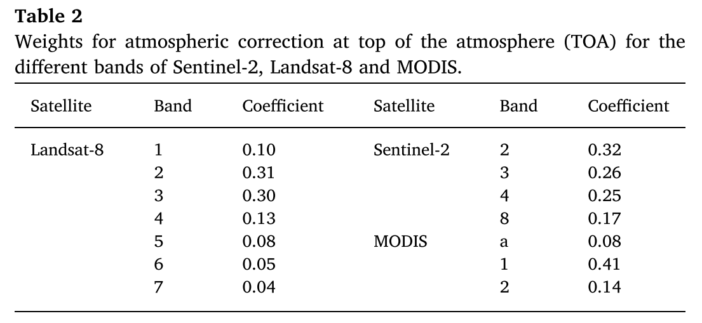
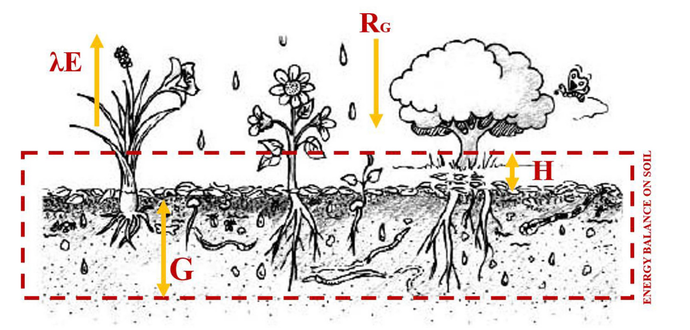

[](https://doi.org/10.5281/zenodo.19210748)

# pySAFER: A Python Toolkit for the Simple Algorithm For actual Evapotranspiration Retrieving
This toolkit is designed to streamline $ET_a$ estimation using the Simple Algorithm for Evapotranspiration Retrieving (SAFER). Whether you are working with station-based point data or satellite-derived imagery, `pySAFER` provides the necessary workflows to quantify water loss.
This repository is structured to help you:
- **Apply the Model:** Follow hands-on tutorials to run $ET_a$ estimations using your own datasets.
- **Understand the Science:** Explore the core concepts and mathematical logic that drive the SAFER framework.

## Model Installation
```bash
pip install "git+https://github.com/RuiGao9/pySAFER.git" 
```

## Model Inputs
- **Albedo ($\alpha_0$):** The ratio between reflected and incident sunlight. A general method to get the $\alpha_0$ has two steps:
  - **$\alpha_P$ calculation:** $\alpha_P$ is the albedo for the visible and infrared partition of the electromagnetic spectrum. $w_{band}$ represents different narrow-band reflectances. $w_{band}$ represents weights for each band. The weights for the different bands was computed as the ration of the amount of the incoming shortwave radiation from the sum in each band and the sum of incoming shortwave radiation from the sum in each band and the sum of incoming shortwave radiation for the bands at the top of the atmosphere (TOA).
  $$\alpha_P=\sum{w_{band} \cdot r_{band}}$$
  
  <div align="center">
    <figure>
      
      <figcaption style="color: grey; font-style: italic; font-size: 0.9em; margin-top: 10px;">
            One case from the paper called agriwater: An R package for spatial modelling of energy balance and actual evapotranspiration using satellite images and agrometeorological data
      </figcaption>
    </figure>
  </div>

  - **$\alpha_0$:** the daily $\alpha_0$ is then obtained by:
  $$\alpha_0=b\cdot \alpha_P+c$$

## Running the Model
The easiest way to get started is by exploring the provided Jupyter Notebook: `pySAFER_Run.ipynb`. This notebook serves as a comprehensive template that demonstrates the end-to-end workflow:
- **Environment Setup:** How to properly import the pySAFER library and its core modules.
- **Data Ingestion:** Loading and preprocessing the included demo datasets (e.g., `point_samples.txt`).
- **Core Computations:** Step-by-step execution of the SAFER algorithm, including:
  - Vegetation indices (NDVI)
  - Extraterrestrial radiation ($R_a$)
  - Surface solar radiation ($R_s$) using both observed and estimated (Hargreaves) methods.
- **Results & Visualization:** Generating $ET_a$ estimates and validating them with built-in plotting tools.

```python

```

# SAFER Concepts
## Model Flowchart
  <div align="center">
    <figure>
      
      <figcaption style="color: grey; font-style: italic; font-size: 0.9em; margin-top: 10px;">
            Energy balance model described by Silva, et al. (2019).
      </figcaption>
    </figure>
  </div>

### Required inputs
- Satellite remote sensing inputs
  - **Normalized Difference Vegetation Index (NDVI):** Calculated from Red ($\rho_{Red}$) and Near-Infrared ($\rho_{NIR}$) bands
  - **Surface Albedo ($\alpha_0$):** Calculated using a weighted sum of multiple bi-directional reflectance bands (Visible and Shortwave).
- Agrometeorological inputs (Point data)
  - **Air temperature ($T_a$):** Daily average temperature ($\degree C$)
  - **Global solar radiation ($R_{s24}$):** Daily total incident shortwave radiation ($MJ/m^2/day$ or $W/m^2$).
  - **Reference evapotranspiration $ET_o$:** Daily depth ($mm/day$)
- Physical & empirical constants
  - **Regression coefficients ($a, b, c$):** Empirical values
  - **Day of year ($DOY$):** Used for the calculation of the inverse relative distance Earth-Sun and solar declination for radiation balance
  - **Geospatial metadata:** Station latitude and elevation (for atmospheric pressure and psychrometric constants)

### Extraterrestrial radiation ($$)
$$R_a=\frac{37.6 \cdot d_r \cdot [w_s \cdot sin(\phi_l)sin(\delta) + cos(\phi_l) \cdot sin(w_s)]}{\lambda}$$

$$\delta = 0.4093 \cdot sin(\frac{2 \pi (284+DOY)}{365})$$

$$d_r = 1 + 0.033 \cdot cos(\frac{2 \pi \cdot DOY}{365})$$

$$w_s = cos(tan(\phi_l) \cdot tan(\delta))$$

where:
- $d_r$: relative distance from the earth to the sun
- $DOY$: day of the year
- $w_s$: sunset hour angle (rad)
- $\phi_l$: latitude (rad)
- $\delta$: declination of the sun (rad) 
- $\lambda$: latent heat of vvaporization, $\lambda=2.54 MJ/kg$

$$LST=({\frac{R_{s24}-\alpha_0 \cdot R_{s24} + \epsilon_A \cdot \sigma \cdot T_a^4 - R_n}{\epsilon_s \cdot \sigma}})^{0.25}$$
- $T_a:$ average air temperature ($\degree C$)


# Reference
Silva, C. D. O. F., de Castro Teixeira, A. H., & Manzione, R. L. (2019). Agriwater: An R package for spatial modelling of energy balance and actual evapotranspiration using satellite images and agrometeorological data. Environmental modelling & software, 120, 104497. https://doi.org/10.1016/j.envsoft.2019.104497<br>
Teixeira, A. H. D. C., Padovani, C. R., Andrade, R. G., Leivas, J. F., Victoria, D. D. C., & Galdino, S. (2015). Use of MODIS images to quantify the radiation and energy balances in the Brazilian Pantanal. Remote Sensing, 7(11), 14597-14619. https://doi.org/10.3390/rs71114597<br>
Teixeira, A. H. D. C., Victoria, D. C., Andrade, R. G., Leivas, J. F., Bolfe, E. L., & Cruz, C. R. (2014, October). Coupling MODIS images and agrometeorological data for agricultural water productivity analyses in the Mato Grosso state, Brazil. In Remote Sensing for Agriculture, Ecosystems, and Hydrology XVI (Vol. 9239, pp. 278-291). SPIE. https://doi.org/10.1117/12.2065967<br>
Safre, A.L.S., Nassar, A., Torres-Rua, A. et al. Performance of Sentinel-2 SAFER ET model for daily and seasonal estimation of grapevine water consumption. Irrig Sci 40, 635–654 (2022). https://doi.org/10.1007/s00271-022-00810-1<br>
Task Committee on Revision of Manual 70. (2016, April). Evaporation, evapotranspiration, and irrigation water requirements. American Society of Civil Engineers. https://doi.org/10.1061/9780784414057<br>
Gao, R., Khan, M., & Viers, J. (2026). A Python Toolkit for Reference Evapotranspiration ($ET_o$) Calculation Directly from Pandas DataFrames (Initial). Zenodo. https://doi.org/10.5281/zenodo.19197914

## How to cite this work
Gao, R. (2026). pySAFER: A Python Toolkit for the Simple Algorithm for actual Evapotranspiration Retrieving (Initial). Zenodo. https://doi.org/10.5281/zenodo.19210748

## Repository update information
- Creation date: 2026-03-24
- Last update: 2026-03-24
- **Contact:** If you encounter any issues or have questions, please contact Rui Gao:
    - Rui.Ray.Gao@gmail.com
    - RuiGao@ucmerced.edu
