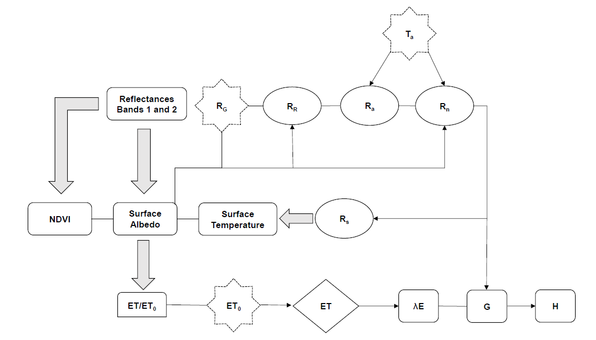

# pySAFER

### Required inputs
- Satellite remote sensing inputs
  - **Normalized Difference Vegetation Index (NDVI):** Calculated from Red ($\rho_{Red}$) and Near-Infrared ($\rho_{NIR}$) bands
  - **Surface Albedo ($\alpha_0$):** Calculated using a weighted sum of multiple bi-directional reflectance bands (Visible and Shortwave).
- Agrometeorological inputs (Point data)
  - **Air temperature ($T_a$):** Daily average temperature ($\degree C$)
  - DOY for sun-earth distance and 

# Reference
Safre, A.L.S., Nassar, A., Torres-Rua, A. et al. Performance of Sentinel-2 SAFER ET model for daily and seasonal estimation of grapevine water consumption. Irrig Sci 40, 635–654 (2022). https://doi.org/10.1007/s00271-022-00810-1 
Gao, R., Khan, M., & Viers, J. (2026). A Python Toolkit for Reference Evapotranspiration ($ET_o$) Calculation Directly from Pandas DataFrames (Initial). Zenodo. https://doi.org/10.5281/zenodo.19197914